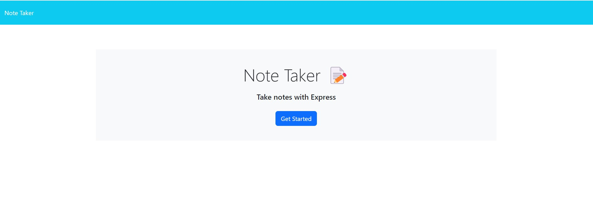
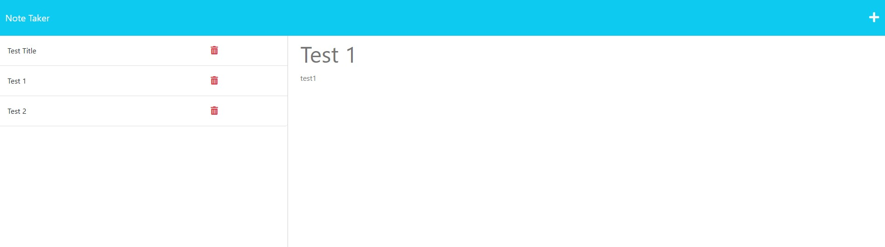

## Note-Taking Application
This is a note-taking application that allows users to create, save, and view notes.

## Usage
To use the Note Taker application, follow these steps:

1. Open the application.
2. On the landing page, click on the Get Started button.
3. On the notes page, the left-hand column displays existing notes, while the right-hand column displays empty fields to enter a new note title and text.
4. To create a new note, enter a title and the text for the note in the fields provided.
5. Once you enter a new note title and text, a Save icon will appear in the navigation at the top of the page.
6. Click on the Save icon to save the new note. The new note will appear in the left-hand column with the other existing notes.
7. To view an existing note, click on the note in the list in the left-hand column. The note will appear in the right-hand column.

## Website
[Heroku website deployment](https://lerobles-note-taker.herokuapp.com/)

## Technology
This application was built using the following technologies:

- HTML
- CSS
- JavaScript
- Node.js
- Express.js
- Bootstrap
- crypto
